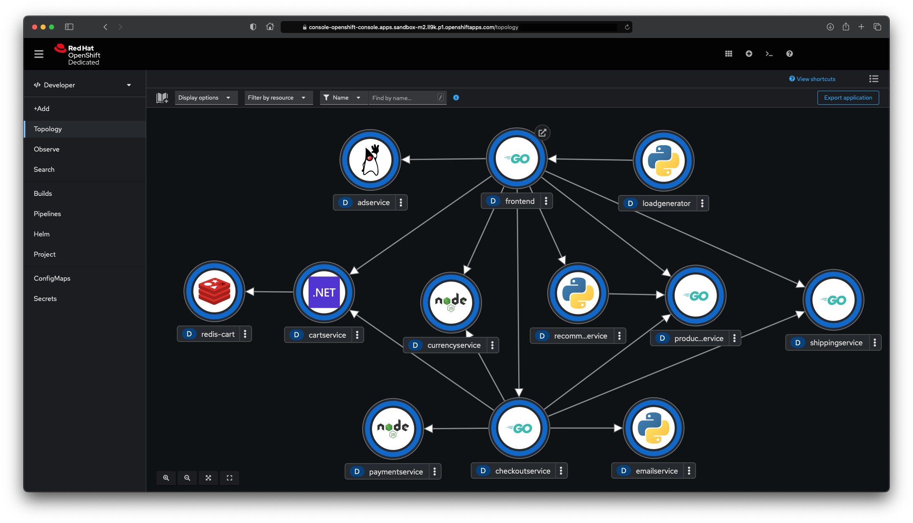

# Microservices Demo Application

This is the [Online Boutique](https://github.com/GoogleCloudPlatform/microservices-demo/) microservices demo application modified to run on OpenShift with some customisation to render nice in the OpenShift graphical console (runtime icons and connection arrows has been added).

To deploy the application:

        oc new project ms-demo
        oc apply -f https://raw.githubusercontent.com/mostmark/microservices-demo/main/application.yaml

